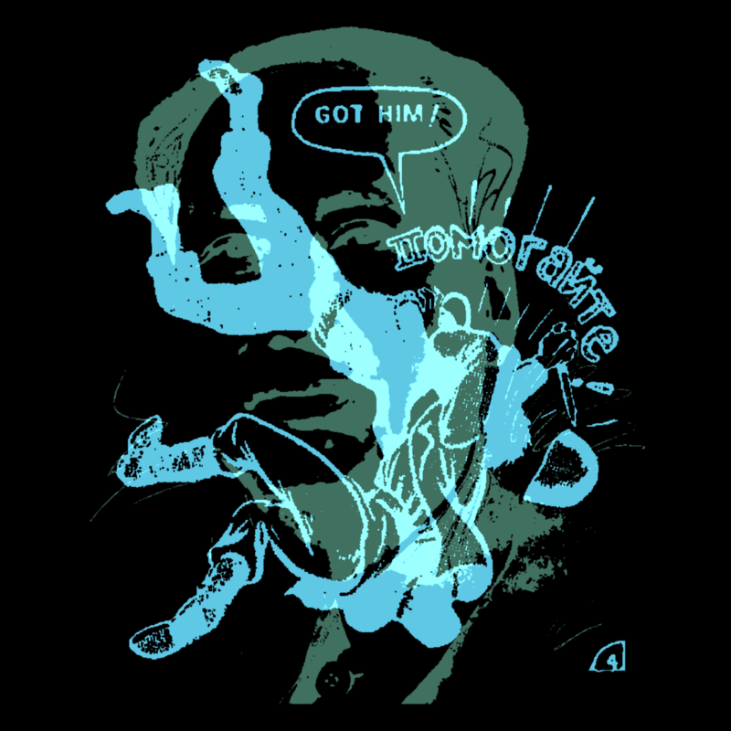

# DUO-CHROME

> **⚠️ This repository has moved to a monorepo**
> 
> Active development now happens in the [GenArt Monorepo](https://github.com/MichaelPaulukonis/genart-monorepo).
> 
> This repository remains active **only** for GitHub Pages deployment. The source code here is no longer maintained.

---



## 🔗 Links

- **Live Demo:** [https://michaelpaulukonis.github.io/duo-chrome/](https://michaelpaulukonis.github.io/duo-chrome/)
- **Monorepo:** [https://github.com/MichaelPaulukonis/genart-monorepo](https://github.com/MichaelPaulukonis/genart-monorepo)
- **Source Code:** [apps/duo-chrome/](https://github.com/MichaelPaulukonis/genart-monorepo/tree/main/apps/duo-chrome)
- **Documentation:** [View in monorepo](https://github.com/MichaelPaulukonis/genart-monorepo/tree/main/apps/duo-chrome/README.md)

## About

Overlays two monochrome images in different colors to create duotone compositions using RISO printing colors and blend modes.

Built with p5.js


## Development

All development happens in the monorepo. To work on this project:

```bash
git clone https://github.com/MichaelPaulukonis/genart-monorepo.git
cd genart-monorepo
pnpm install
nx dev duo-chrome
```

See the [monorepo documentation](https://github.com/MichaelPaulukonis/genart-monorepo) for more details.

## License

MIT
